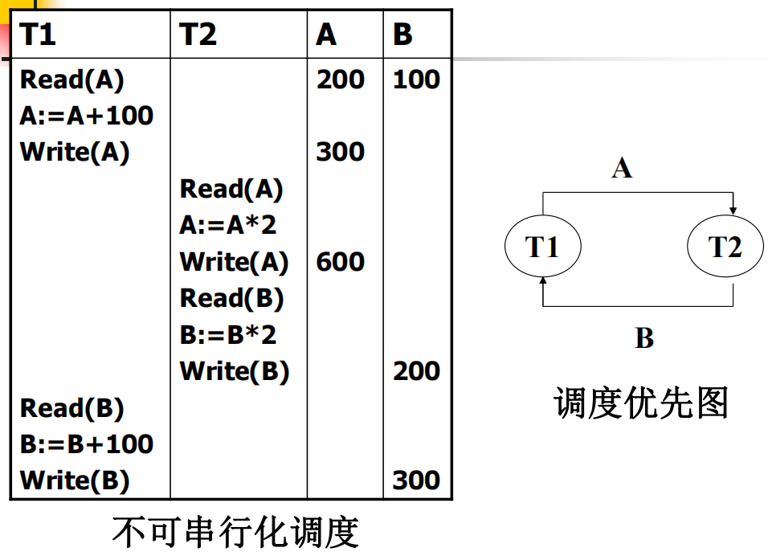

# 九、并发控制

[TOC]

## 问题提出

- 多事务执行方式(续)
  - (1)事务串行执行
  - (2)交叉并发方式interleaved concurrency
    - 并行事务的并行操作轮流交叉运行
    - 是单处理机系统中的并发方式，能够减少处理机的空闲时间，提高系统的效率
  - (3)同时并发方式simultaneous  concurrency
    - 多处理机系统中，每个处理机可以运行一个事务，多个处理机可以同时运行多个事务，实现多个事务真正的并行运行
    - 最理想的并发方式受制于硬件环境、更复杂的机制

## 并发事务运行存在的异常问题

### 1. 丢失更新

- 以飞机定票系统为例， 
  甲售票点事务T1和乙售票点事务T2同时读取某航班的机票余额R=100 ；
  - 分别售出1张机票
    结果明明卖出两张机票，数据库中机票余额只减少1
- 丢失更新是指
  - 事务 T1、T2 **读取同一个数据**并各自**修改**
  - T2 的提交结果**覆盖**了 T1 的提交结果
  - T1 的**修改失效**（丢失），这就叫 丢失更新（Lost Update）

### 2. 不可重复读

- 不可重复读是事务T1读取数据后，T2对同一数据执行更新操作，使T1再次读取该数据时，得到与前一次不同的值。 

- 三类不可重复读：
- ​事务1读取某一数据后：
  - T2对其做了**修改**,当T1再次读该数据时,得到与前一次==不同的值==
  - T2**删除**了其中部分记录，当T1再次读取数据时，==某些记录消失==
  - T2**插入**了一些记录，当T1再次按相同条件读数据时, ==多了一些记录==
  - 后两种不可重复读有时也称为==幻影现象==（多了一些值和少了一些值都称为幻影现象）

> 【我的补充】
> 大部分日常场景：没问题，甚至正常。
> 
> 只有需要 “事务内数据绝对静止” 的场景：才是问题。例如：银行想统计账户A和B的总存款。初始它们各有100元。先读A，有100元；然后A转了100元给B；再读B，有200元。总存款是300元，错误。

### 3. 读“脏”数据

- 事务1修改某一数据，并将其写回磁盘
- 事务2读取同一数据后,事务1由于某种原因被**撤销**，这时事务1**已修改过的数据恢复原值**
- 事务2读到的数据就与数据库中的数据不一致，是不正确的数据，又称为“脏”数据。

### 异常问题

并发操作带来的数据不一致性
1. 丢失更新（lost update）
2. 不可重复读(non-repeatable read)
3. 读“脏”数据(dirty read)

|                           丢失更新                           |                          不可重复读                          |                          读“脏”数据                          |
| :----------------------------------------------------------: | :----------------------------------------------------------: | :----------------------------------------------------------: |
|  |  |  |

- 这种数据库的不一致性是由并发操作引起的，主要原因是==并发操作破坏了事务的隔离性==
  - 并发控制机制要用正确的方式调度并发操作，使一个用户事务的执行不受其他事务的干扰，避免造成数据的不一致性 
    - 保证事务的==隔离性==
    - 保证数据库的==一致性==

## 并发调度的可串行性
> 【Allen提醒】这一节感觉知识的前后顺序有点不符逻辑。我觉得应该先讲**状态等价**和**冲突等价**的定义，然后就能直接直接对应**状态可串行**（也就是教材说的“可串行化调度”）以及**冲突可串行**。这一节感觉主要就是理解这4个名词。

- 计算机系统对并行事务中并行操作的调度是随机的，而不同的调度可能会产生不同的结果。

- ==将所有事务串行起来的调度策略是正确的调度策略==。

- 如果一个事务运行过程中没有其他事务在同时运行，也就是说它没有受到其他事务的干扰，那么就可以认为该事务的运行结果是正常的或者预想的

- ==以不同的顺序串行执行事务也有可能会产生不同的结果==，但由于不会将数据库置于不一致状态，所以==都可以认为是正确的==

### 可串行化调度

定义9.1 多个事务的并发执行是正确的，当且仅当并发执行的结果与这些事务按某一串行顺序执行的**结果相同**，这种调度策略被称为==**可串行化调度**==。
> 【**补充**】此处 “结果” 专指所有事务执行完毕后，数据库中**数据的最终状态**，不包含事务执行过程中读取到的中间值。即“状态可串行”（状态可串行后面会讲）。

**可串行化是并发事务正确调度的准则** 。

- 可串行性是并行事务正确性的唯一准则
- 按这个准则规定，一个给定的并发调度，当且仅当它是可串化的，才认为是正确调度
- 例：现在有两个事务，分别包含下列操作：
  - 事务1：读B；A=B+1；写回A；
  - 事务2：读A；B=A+1；写回B；
  - 假设A的初值为2，B的初值为2。
- 对这两个事务的不同调度策略
  - 串行执行
    - (a)串行调度策略、 (b)串行调度策略
  - 交错执行
    - (c)不可串行化的调度、 (d)可串行化的调度

### 调度的冲突等价性

- 冲突操作
  - 冲突操作是指==不同的事务对同一个数据的读写操作和写写操作==
    - Ri(x)与Wj(x)	          /* 事务Ti读x，Tj写x*/
    - Wi(x)与Wj(x)	          /* 事务Ti写x，Tj写x*/
  - 其他操作是不冲突操作
  - 不同事务的冲突操作和同一事务的两个操作不能交换(Swap) 

定义9.2  如果一个调度S能通过一系列**非冲突操作**执行顺序的交换变成调度S1，则称==调度S和S1**冲突等价**==。 

【例 9-3】证明调度S是否是可串行化调度。
$$
S=R_1(A)W_1(A)R_2(A)W_2(A)R_1(B)W_1(B)R_2(B)W_2(B)
$$

- 直接把 $R_2(A)W_2(A)$ 和 $R_1(B)W_1(B)$ 交换（它们处理不同数据，不冲突）。交换一组操作能通过两两交换操作达成吗？可以，考虑一下冒泡是怎么做的。
$$
L=R_1(A)W_1(A)R_1(B)W_1(B)R_2(A)W_2(A)R_2(B)W_2(B)
$$
- 因为L等价于一个串行调度T1，T2，所以调度S是可串行化的调度，L和S是(冲突)==等价的== 

> 也就是可以看到将下标顺利分成左边全为1右边全为2，我们就认为这个调度是可串行化的调度

### 调度的状态等价性

定义9.4 我们称一个调度是状态==可串行的==，如果它的状态等价于一个串行调度。
> 如果**初始数据库状态相同**，两个不同的调度能**产生相同的数据库状态**，则认为这两个调度是状态等价的。这种等价性称为数据库状态等价性

- 可串行化调度的充分条件
  - 一个调度S在保证冲突操作的次序不变的情况下, 通过交换两个事务不冲突操作的次序得到另一个调度S’ , 如果S’是串行的, 称调度S为**冲突可串行化的调度**

- 一个调度是冲突可串行化，一定是==状态可串行==的（可串行化的调度）
  - 冲突可串行化调度是可串行化调度的充分条件，不是必要条件。还有不满足冲突可串行化条件的可串行化调度

【例】有3个事务

T1 = <u>W1(Y)W1(X)</u>，T2 = *W2(Y)W2(X)*，T3 = **W3(X)**

调度L1 = <u>W1(Y)W1(X)</u> *W2(Y)W2(X)* **W3(X)** 是一个串行调度

调度L2 = <u>W1(Y)</u> *W2(Y)W2(X)* <u>W1(X)</u> **W3(X)** 不满足冲突可串行化

- 因为每对操作都是冲突的，不能交换
- 但是调度L2是可串行化的。因为L2执行的==结果==与调度L1==相同==，Y的值都等于T2的值，X的值都等于T3的值 

### 调度的可串行性测试

**构造调度的优先图（前趋图）**
> 如果觉得定义抽象，可以看看后面的例子

调度 S 的优先图是一个有向图 $G(V,E)$，其中
- $V$：一组节点$V=\{T_1,T_2,...,T_n\}$，代表$S$中的事务
- $E$：一组有向边$E=\{e_1,e_2,...,e_n\}$

$T_i \to T_j$ 是图中的一条边，当且仅当 $\exists\ 操作p \in T_i,\ 操作q \in T_j$，使得 $p,q$ 冲突，并且 $p <_S q$ （$p$ 在 $q$ 的前面执行）

**判定结论**：当且仅当优先图中没有回路时，调度$S$才是（冲突）可串行化的。

**三步走**：
1.  找冲突操作：
    按**数据项**分组，对同一数据、不同事务的操作，只要不是「读-读」，其余（读-写、写-读、写-写）均为冲突操作。

2.  画优先图边：
    对每一对冲突操作，按执行顺序画边：先执行的事务 → 后执行的事务（重复边只画一次）。

3.  判环得出结论：
    - 优先图无环 → 调度冲突可串行化
    - 优先图有环 → 调度冲突不可串行化

#### 例子



1. 按执行先后，列出各数据项的所有操作
   - **数据A**：`T1.Read(A)` → `T1.Write(A)` → `T2.Read(A)` → `T2.Write(A)`
   - **数据B**：`T2.Read(B)` → `T2.Write(B)` → `T1.Read(B)` → `T1.Write(B)`

2. 对每个数据项，找跨事务的冲突对
   - **A的冲突对**：
     - `T1.Write(A)` 与 `T2.Read(A)`
     - `T1.Write(A)` 与 `T2.Write(A)`
   - **B的冲突对**：
     - `T2.Write(B)` 与 `T1.Read(B)`
     - `T2.Write(B)` 与 `T1.Write(B)`

3. 按执行顺序画优先图边
   - A的冲突：`T1 → T2`
   - B的冲突：`T2 → T1`

4. 判环结论：优先图存在 `T1 → T2 → T1` 回路，该调度**不可冲突串行化**。

## 锁
锁是数据对象的一种状态，有共享锁（S锁/读锁）和排它锁（X锁/写锁）两种。
- S锁满足：若事务已对数据A加S锁，则其他事务仍可以对A加S锁，但是不能加X锁（直到所有S锁释放）；
- X锁满足：若事务已对数据A加X锁，则其他事务不能加S锁也不能加X锁（直到当前X锁释放）。
- 一个数据项，要么有 1 个或多个 S 锁，要么 只有一个 X 锁

### 核心原理(Allen核心洞察)
- 锁不会直接限制读写操作，仅直接限制「加锁行为」。

- **封锁协议**将读写操作与加锁行为绑定在一起，利用锁的阻塞原理间接限制了读写操作的先后顺序，进而避免了三大异常问题。

## 封锁协议
> 这是Allen的**精辟总结**，觉得写的太精准，我把原作的图都删完了

1. 一级封锁协议：要求事务写数据前需要加X锁，直到事务结束。分析该协议的特点：T1写A前，对A加X锁，这样T2仍能读A，但不能对A加X锁，进而也不能写A。这样就没有丢失更新的问题了。但是仍有“不可重复读”和“读脏数据”的问题。

2. 二级封锁协议：在一级封锁协议基础上，要求事务读数据前需要加S锁，读完就立即释放。分析特点：T1写A，对A加X锁，如果T1后来rollback，但是事务未完成X锁未释放，所以T2不能给A加S锁，进而T2不能读A，这样就避免了“读脏数据”的问题。但是仍有“不可重复读”的问题。

3. 三级封锁协议：在二级协议基础上，把二级封锁协议的“立即释放”改为“直到事务结束才释放”。分析特点：T1事务连续两次读A，第一次读A时加了S锁，在T1结束前，T2不能给A加X锁，进而不能写A。这样就避免了“不可重复读”的问题。
---

### 一致性保证 

|              | X锁          |S锁           | 一致性保证    | 👈          | 👈       |
| ------------ | ------------ |------------  | ------------ | ----------  | ----------|
|              | 释放时间      |  释放时间    | 不丢失修改    | 不读脏数据   | 可重复读   |
| 一级封锁协议 |   事务结束     | （无S锁要求）| √            |             |           |
| 二级封锁协议 |   事务结束    | 操作结束       | √            | √           |           |
| 三级封锁协议 |   事务结束    | 事务结束     | √            | √           | √         |
  
## 活锁
> 我觉得这个概念是“为赋新词强说愁”。我觉得是先发明了申请队列的概念，然后为了说明没有申请队列会发生什么问题，才发明了这个愚蠢的“活锁”概念。实际上，“没有申请队列”可不是能那么简单假设的情况，比如这个T2，它先申请的锁，被阻塞后你就不管它了？你但凡把它记下来，都不至于让T3,T4抢先吧。

封锁技术可以有效地解决并行操作的一致性问题，但也带来一些新的问题：死锁，活锁

- 活锁：在数据库系统中活锁是指某个事务由于请求封锁，但总也得不到锁而==长时间处于等待状态==


- 如何避免活锁
  - 采用先来先服务的策略：
    - 当多个事务请求封锁同一数据对象时,按请求封锁的先后次序对这些事务排队
    - 该数据对象上的锁一旦释放，首先批准**申请队列**中第一个事务获得锁。

## 死锁
> 感觉下面这个文字表述也挺抽象的，我觉得记住后边的例子就行了

死锁是指在同时处于等待状态的两上或多个事务中相互封锁了对方请求的资源，使得没有任何一个事务可以获得足够的资源运行完毕，而永远等待下去。

|  | - 如事务T1，已封锁了数据R1，而事务T2，封锁了数据R2，
- T1又继续请求封锁R2，因T2已经封锁了R2，因而T1等待T2释放R2；
- 接着而T2又继续请求封锁R1，因T1已经封锁了R1，因而T2等待T1释放R1。
- T1、T2相互等待对方释放锁，形成死锁 |
| ------------------------------------------------------------ | ------------------------------------------------------------ |
 
**解决死锁的方法**

1. 预防死锁
2. 检测死锁，然后解除死锁

### 预防死锁

- **分析产生死锁的原因**
  - 两个或多个事务都已封锁了一些数据对象，
  - 然后又都请求对已被其他事务封锁的数据对象加锁
  - 出现死等待
- 预防死锁的发生就是要破坏产生死锁的条件
- 预防死锁的方法
  - 一次封锁法
      - 【要求】事务在开始执行前，**获得所有数据项上的锁**
      - 【问题】①降低系统并发度；②很难事先精确确定每个事务所要封锁的数据对象。
  - 顺序封锁法
      - 【要求】预先对数据对象规定一个封锁顺序，所有事务都按这个顺序实行封锁。
      - 【问题】事务的封锁请求可以随着事务的执行而动态地决定，很难事先确定每一个事务要封锁哪些对象，因此也就很难按规定的顺序去施加封锁。
  - 事务重试法（**主流**）
    - 【方法】T2 申请锁时若被 T1 占用，系统可按事务启动顺序，回滚 T1 以**抢占（强制回收）** 锁资源，分配给 T2，T1 回滚后自动重试。
      > 说明：此处 “抢占” 即系统强制回收资源；事务回滚会终止执行，锁自动释放；我感觉这个不算“预防”，应该是“检测与解除”。

### 死锁的检测与恢复

- 允许死锁发生

- 解除死锁

  - 由DBMS的并发控制子系统定期检测系统中是否存在死锁
  - 检测到死锁后执行解除操作：
    - 选取**代价最小**的事务执行回滚，该事务持有的锁全部释放，其余事务可继续执行

- 事务等待图法

  - 用事务等待图动态反映所有事务的等待情况

  - 事务等待图是一个有向图G=(V，U)

    - V为结点的集合，每个结点表示正运行的事务

    - U为边的集合，每条边表示事务等待的情况

  - 若V1等待V2，则V1，V2之间画一条有向边，从V1指向V2

  - 并发控制子系统周期性地（比如每隔1 min）检测事务等待图，如果发现图中存在回路，则表示系统中出现了死锁。


> 只要破坏环就可以解锁了。

## 两阶段封锁协议
> 该协议一句话就是：**所有加锁必须在所有解锁之前完成**，是另一套规则，和三级封锁协议没有直接关系。不过“满足三级封锁 $\Rightarrow$ 满足两阶段封锁”，因为三级封锁要求事务结束时才解锁。

- 两阶段封锁协议(Two-Phase Locking，简称2PL)是最常用的一种封锁协议
  - 理论上可以证明使用两阶段封锁协议的并行调度产生的是**可串行化调度**，并行执行的结果一定正确
    - 但遵守两阶段封锁协议是可串行化的充分不必要条件，可串行化的调度中，不一定所有事务都必须符合两阶段封锁协议。

- “两阶段”锁的含义：事务分为两个阶段
  - 第一阶段是获得封锁，也称为扩展阶段。
    - 在这阶段,事务可以申请获得任何数据项上的任何类型的锁，但是不能释放任何锁
  - 第二阶段是释放封锁，也称为收缩阶段。
    - 在这阶段,事务可以释放任何数据项上的任何类型的锁，但是不能再申请任何锁。

例：事务1遵守两阶段封锁协议，事务2不遵守两阶段封锁协议

```sql
Slock A ... Slock B ... Xlock C ... Unlock B ... Unlock A ... Unlock C
Slock A ... Unlock A ... Slock B ... Xlock C ... Unlock C ... Unlock B
```

- 两阶段封锁协议与防止死锁的一次封锁法
  - 一次封锁法要求每个事务必须一次将所有要使用的数据全部加锁，否则就不能继续执行，因此一次封锁法遵守两段锁协议
  - 但是两阶段封锁协议并不要求事务必须一次将所有要使用的数据全部加锁，因此遵守两阶段封锁协议的事务**可能发生死锁**

| 遵守两阶段封锁协议的事务发生死锁 |  |
| -------------------------------- | ------------------------------------------------------------ |
## 锁的管理—锁表

### 如何维护锁
- 锁的请求、授予和解除是由数据库系统的 **锁管理器（Lock Manager）** 维护。
- 锁管理器为目前已加锁的数据项维护一个记录链表，这个链表称为**锁表（Lock Table）**。
- 锁表中的一条记录表示一个锁请求，内容包括：
  - 请求锁的事务
  - 请求的锁类型
  - 是否已经授予锁等
- 所有请求按照到达的先后顺序排序

## 多粒度封锁

- 选择封锁粒度的原则
  - 封锁的粒度越大，小，
  - 系统被封锁的对象少，多，
  - 并发度小，高，
  - 系统开销小，大，
  - 选择封锁粒度考虑系统开销和并发度两个因素，对系统开销与并发度进行权衡
    - 需要处理多个关系的大量元组的用户事务：以数据库为封锁单位；
    - 需要处理大量元组的用户事务：以关系为封锁单元
    - 只处理少量元组的用户事务：以元组为封锁单位

- 多粒度封锁机制
  - 在一个系统中同时支持多种封锁粒度；
  - 允许事务选择不同大小的粒度作为封锁单元；
  - 不同的封锁粒度可以用**多粒度树**表示
    - 以树形结构来表示多级封锁粒度；
    - 根结点是整个数据库，表示最大的数据粒度；
    - 叶结点表示最小的数据粒度。
  - 例：三级粒度树。根结点为数据库，数据库的子结点为关系，关系的子结点为元组。


- 多粒度封锁协议
  - 允许多粒度树中的每个结点被独立地加锁
  - 对一个结点加锁意味着这个==结点的所有后裔结点也被加以同样类型的锁==
  - 在多粒度封锁中一个==数据对象可能以两种方式封锁==，封锁的效果是一样的
    - 显式封锁: 直接加到数据对象上的封锁
    - 隐式封锁: 由于其上级结点加锁而使该数据对象加上了锁

- 系统检查封锁冲突时
  - 既要检查显式封锁，还要检查隐式封锁
  - 对某个数据对象加锁时，系统检查的内容包括
    1. 该数据对象本身有无显式封锁冲突
    2. 是否与所有上级结点的显式封锁冲突（上级结点的显式封锁相当于本结点的隐式封锁）
    3. 是否与所有下级结点的显式封锁冲突（本结点的显式封锁将成为下级结点的隐式封锁）
  - 检查的内容多，效率低

### 意向锁
> 为了提高多粒度封锁的**检查效率**，在多粒度封锁机制中引入了意向锁（ $\text{intention lock}$ ）

- 什么是意向锁
  - 对任一结点加基本锁（普通锁），必须先对它的**所有祖先节点**加意向锁
- 如果对一个结点加意向锁，则说明该结点的下层结点正在被加锁
- 例：对任一元组 $t$ 加锁，先对关系 $R$ 加意向锁

|  |  |
| ------------------------------------------------------------ | ------------------------------------------------------------ |

- 意向共享锁( $\text{Intent Share Lock}$ ，简称 $\text{IS}$ 锁)
  - 如果对一个数据对象加 $\text{IS}$ 锁，表示它的后裔结点拟(意向)加 $\text{S}$ 锁。例:要对某个元组加 $\text{S}$ 锁，则要先对关系和数据库加 $\text{IS}$ 锁
- 意向排它锁( $\text{Intent Exclusive Lock}$ ，简称 $\text{IX}$ 锁)
  - 如果对一个数据对象加 $\text{IX}$ 锁，表示它的后裔结点拟(意向)加 $\text{X}$ 锁。例:要对某个元组加 $\text{X}$ 锁，先要对关系和数据库加 $\text{IX}$ 锁
- 共享意向排它锁( $\text{Share Intent Exclusive Lock}$ ,简称 $\text{SIX}$ 锁)
  - 如果对一个数据对象加 $\text{SIX}$ 锁，表示对它加 $\text{S}$ 锁，再加 $\text{IX}$ 锁，即 $SIX = S + IX$ 。例：对某个表加 $\text{SIX}$ 锁，则表示该事务要读整个表（所以要对该表加 $\text{S}$ 锁），同时会更新个别元组（所以要对该表加 $\text{IX}$ 锁）

### 意向锁的相容矩阵

> 在理解相容矩阵时可以这样去理解而不用死记硬背：
>
>  $\text{X}$ ：写全表
>
>  $\text{IX}$ ：写表中某一行
>
>  $\text{S}$ ：读全表
>
>  $\text{IS}$ ：读表中某一行
>
>  $\text{SIX}$ ：读全表而写其中某一行
>
> 这样就很方便理解下面矩阵了，而且也很经得起推敲，比如
>
>  $\text{IX}$ 和 $\text{SIX}$ 是否相容：
>
> 一个事务申请写表中某一行，另外一个事务申请读全表，肯定不相容；
>
>  $\text{IX}$ 和 $\text{IX}$ 是否相容：
>
> 一个事务申请写其中某一行，另一个事务申请写其中某一行，相容（只要不是同一行）；
> 
>  $\text{IS}$ 和 $\text{SIX}$ 是否相容：
> 
> 一个事务申请读表中某一行，另一个事务申请“读全表+写表中某一行”，相容（只要前者读的和后者写的不是同一行）
> 
>  $\text{SIX}$ 和 $\text{SIX}$ 是否相容：
> 
> 一个事务申请“读全表+写表中某一行”，另一个事务申请读全表，肯定不相容，更别提再写表中某行了。

|                       意向锁的相容矩阵                       |                      锁的强度的偏序关系                      |
| :----------------------------------------------------------: | :----------------------------------------------------------: |
|  |  |
|                   针对于两个事务所申请的锁                   |                        针对于一个事务                        |

- 锁的强度
  - 锁的强度是指它对其他锁的排斥程度
  - 一个事务在申请封锁时以强锁代替弱锁是安全的，反之则不然

- 具有意向锁的多粒度封锁方法
  - **申请**封锁时应该按**自上而下**的次序进行；
  - **释放**封锁时应该按**自下而上**的次序进行   
- 例如：事务 $T_1$ 要对关系 $R_1$ 加 $S$ 锁
  - 要首先对数据库加 $IS$ 锁
  - 检查==数据库和 $R_1$ ==是否已加了不相容的锁( $X$ 或 $IX$ )
  - 不再需要搜索和检查== $R_1$ 中的元组==是否加了不相容的锁( $X$ 锁) 


