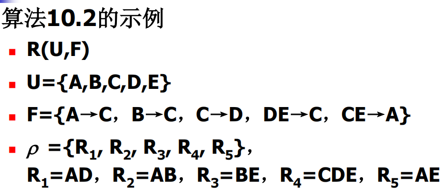
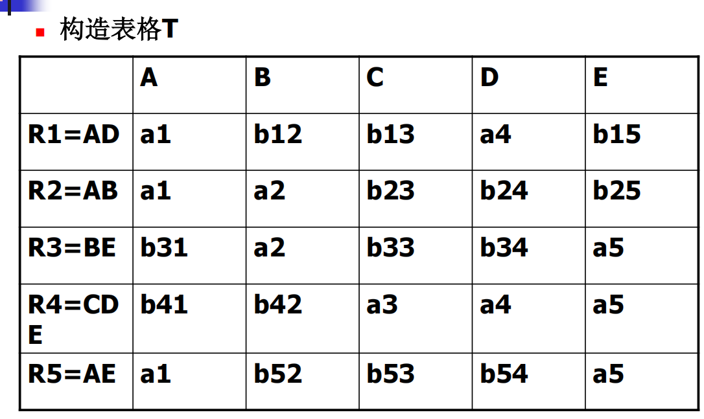
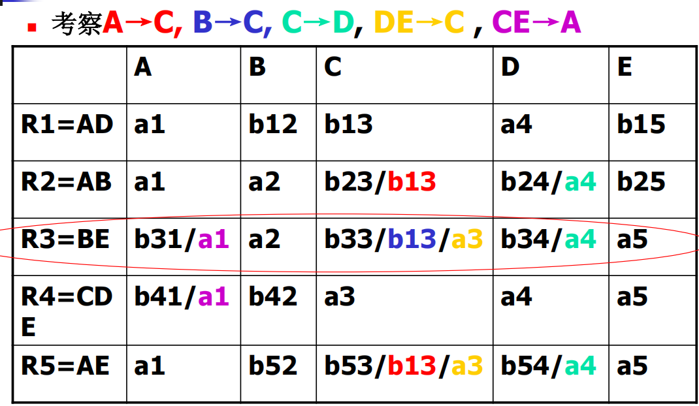

# 十、关系数据库设计理论

[TOC]

> 感觉这章就是教你怎么设计表的，怎么拆表~

## 关系模型的存储异常

- 关系模型的==存储异常==
  - 数据冗余 
    - 大量的数据冗余不仅造成存储空间的浪费，而且存在着潜在的数据不一致
  - 插入异常
  - 删除异常
  - 更新异常

## 函数依赖的定义

- 函数依赖(Functional Dependency, FD)是现实世界中最广泛存在的一种数据依赖，

  - 是现实世界属性间相互联系的抽象;
  - 是数据内在的性质;
  - 它表示了关系中属性间的一种制约关系。

1. 函数依赖
2. 平凡函数依赖与非平凡函数依赖
3. 完全函数依赖与部分函数依赖
4. 传递函数依赖

- 【定义10.1】设关系模式 $R(U)$ ，$X,Y\subseteq U$，$r$ 是 $R(U)$ 上的任一关系。对任意元组 $t_1 ,t_2\in r$, 如果 $t1,t2$ 在 $X$ 上的属性值相等， $t1, t2$ 在 $Y$ 上的属性值亦相等，
  - 则称 $X$ **函数决定** $Y$ ,或 $Y$ **函数依赖于** $X$ ，记为$FD\ X→Y$
  - 称 $X$ 为决定因素，或称 $X$ 为函数依赖的左部，
  - 称 $Y$ 为函数依赖的右部。 

> $X\rightarrow Y$
>
>
>  $Y$ 依赖于 $X$ ，若 $Y$ 中有 $X$ 中没有的属性（ $Y \not\subset X$ ），则叫**非平凡函数依赖**；若 $Y$ 中的属性都是 $X$ 中有的属性（$Y \subset X$），那么就叫**平凡函数依赖**
>
> | 非平凡、平凡                                                  |完全、不完全                                                   |
> | ------------------------------------------------------------ | ------------------------------------------------------------ |
> |  |  |
> 

- 【定义10.3】若存在 $X' \subset X$ 使得 $X' \subset Y$ ，则称 $FD\ X \rightarrow Y$ 是**部分函数依赖**；否则就是**完全函数依赖**。
- 【定义10.4】设关系模式 $R$ ，$X,Y,Z$ 是 $R$ 的属性子集，若 $FD\ X \rightarrow Y, Y \not\rightarrow X, Y \rightarrow Z$ ，则称 $FD\ X \rightarrow Z$ 为**传递函数依赖**。
  > **注意**：若$FD\ X \rightarrow Y, Y \rightarrow X$，则 $X \leftrightarrow Y$ ，此时若 $Y \rightarrow Z$ ，由此得到的 $X \rightarrow Z$ ，称为 $Z$ 直接依赖于 $X$ 。
## 函数依赖的蕴涵性

- 一个关系模式 $R$ 上的任一关系 $r(R)$ ，在任意给定的时刻都有它所满足的一组函数依赖集 $F$ 
  - 若关系模式 $R$ 上的任一关系都能满足一个确定的函数依赖集 $F$ ，则称 $F$ 为 *R满足* 的==函数依赖集== 
    > 注意，$R$ 是关系模式，这句是给出“关系模式满足的函数依赖集”的定义。

- ==对于给定的一组函数依赖，需要判断另外一些函数依赖是否成立==。例如,已知关系模式 $R$ 上的函数依赖集为 $F$ , $F$ 中有函数依赖$X→Y，X→Z$，问 $X→YZ$ 是否成立。
  > 这是==函数依赖的逻辑蕴涵==所要研究的问题

- 【定义10.5】设函数依赖集 $F$ 和关系模式 $R(U)$ ，属性集$X,Y\subseteq U$，关系模式 $R$ 满足 $F$ 。如果关系模式 $R$ 满足 $FD\ X→Y$，则称 $F$ **逻辑蕴涵** $FD\ X→Y$，或称 $X→Y$ **逻辑蕴涵于** $F$ 。记为 $F\ |= X→Y$ 。 
  > 注意这个定义的意思是，如果“ $R 满足F \Rightarrow R 满足 X \rightarrow Y$ ”，那就称 $F$ ==逻辑蕴涵== $FD\ X→Y$ ,所以这里的逻辑蕴涵，和数理逻辑的那个其实一个意思。

- 【定义10.6】设函数依赖集 $F$ ，所有被 $F$ 逻辑蕴涵的函数依赖称为==$F$ 的闭包==，记为 $F^+$ 
  - $F^+$ 可表示为： $F^+ = \{ X→Y|F\ 逻辑蕴涵\ FD\ X→Y\}$

- 【定义10.7】设关系模式 $R(U，F)$ ，$U$ 是 $R$ 的属性全集，$F$ 是 $R$ 的函数依赖集，$X$ 是 $U$ 的子集。如果满足条件：
  - (1) $X \rightarrow U\in F^+$；
  - (2) 不存在 $X'\subset X$ 且 $X' \rightarrow U\in F^+$成立。
  
  则称 $X$ 为模式 $R$ 的一个**候选键**。 
  > 满足(1)的称为超键，也就是**能唯一区分元组**。候选键是“极小”的超键，去掉任一属性后不再是超键。
  >
**求候选键的方法**：
 
1. 首先利用定理缩小候选键的可能取值范围：在函数依赖集 $F$ 中，只在左部出现过的属性一定在候选键中，只在右部出现过的属性一定不在候选键中。
2. 把一定在的加入 $K$ ，然后尝试用 $K$ 推出属性全集 $U$，不能的话，再加入别的属性。

## Armstrong公理

- 函数依赖的公理系统是模式分解算法的理论基础，
  - 从一组函数依赖求得蕴含的函数依赖
  - 求给定关系模式的关键字 
- Armstrong公理 
  - 设关系模式 $R(U，F)$，并且 $X、Y、Z$ 和 $W$ 是 $U$ 的子集
  - A1  自反律(Reflexivity) 【平凡函数依赖】
    - 若$Y\subseteq X\subseteq U$, 则 F |= X→Y；
    > 多属性的 $X$ 可以推自己的属性子集
  - A2  增广律(Augmentation) 
    - 若X→Y且$Z\subseteq U$，则 F |= XZ→YZ；
    > **推论**：在 $X \rightarrow Y$ 左部加 $R$ 的属性，所得函数依赖 $XZ \rightarrow Y$ 仍成立（证明：由自反律得 $YZ \rightarrow Y$ ，再用传递律）
  - A3  传递律(Transitivity)
    - 若X→Y, Y→Z，则 F |= X→Z.

> **三条有用推论**：
> 
> 合成规则：$X \rightarrow Y, X \rightarrow Z \Rightarrow X \rightarrow YZ$
> 
> 分解规则：$X \rightarrow Y, Z \subseteq Y \Rightarrow X \rightarrow Z$
> 
> 伪传递规则：$X \rightarrow Y, YZ \rightarrow W \Rightarrow XZ \rightarrow W$
> 
> 根据合成规则和分解规则，可得**充分必要条件**：$X \rightarrow A_1A_2 \cdots A_K \Leftrightarrow X \rightarrow A_i(i=1,2,\cdots, k)$

## 属性闭包

- 【定义10.8】设关系模式 $R(U, F)$ ，$U={A_1,A_2,…,A_n}$ ，$X\subseteq U$。所有用公理由 $F$ 推出的函数依赖 $X→A_i$ 中 $A_i$ 的属性集合称为==属性集 $X$ 关于函数依赖集 $F$ 的闭包==，记为 $X_{F}^+$ 。

$$
X_{F}^+ =\{A_i  | 可用公理由\ F\ 推出\ X→A_i\}
$$

- 显然，由自反律知道 $X\subseteq X_{F}^+$ 。
- 例如，设 $R(A, B, D, E, H)$，
  $R$ 上的函数依赖集 $F=\{A→D，AB→DE，E→H\}$
- 若 $X=\{A\}$ ，$(A)_{F}^+ =AD$。 
- 若 $X=\{AB\}$ ，$(AB)_{F}^+ =ABDEH$。

- 【定理10.1】设关系模式 $R(U,F)$ ，$X, Y \subseteq U$ ；能够由 $Armstrong$ 公理从 $F$ 推导出 $X \rightarrow Y$ 的充要条件是 $Y \subseteq X_F^+$ 。 
  > 根据定理10.1，可以将判定 **$X→Y$ 是否能由 $F$ 根据 $Armstrong$ 公理导出** 的问题转化为：求出 $X_F^+$ ，判定 **$Y$ 是否为 $X_F^+$** 的子集的问题。换句话说，
  > $$
  > X \rightarrow Y \in F^+ \Leftrightarrow Y \subseteq X_F^+（重要！）
  > $$

## 求属性闭包的算法

- 输入：模式 $R$ 的属性全集 $U$，$U$ 上的函数依赖集 $F$，属性集 $X$
- 输出：属性集 $X$ 的闭包 $X^+$

1. 初值 $X^{(0)} = X$，$i=0$；
2. $X^{(i+1)} = X^{(i)} \cup Z$；其中 $Z = \{ A \mid \text{存在 } V \to W \in F,\ V \subseteq X^{(i)} \text{ 且 } A \in W \text{ 而 } A \notin X^{(i)} \}$
3. 判断 $X^{(i+1)} = X^{(i)}$ 或 $X^{(i+1)} = U$ 是否成立，若成立转(5)
4. $i = i + 1$，转(2)；
5. 输出 $X^+$ 的结果 $X^{(i+1)}$。

- 循环次数
  - 令 $a_i=|X^{(i)}|$，$\{a_i\}$形成一个步长不超过1的严格递增的序列，序列的上界是 $|U|$ ，因此算法最多循环 $|U|-|X|+1$ 次。

【例10-1】

设关系模式 $R(U,F)$，属性全集 $U=\{A,B,C,D,E,G\}$，
函数依赖集 $F=\{ AB \to C,\ BC \to D,\ ACD \to B,\ D \to EG,\ BE \to C,\ CE \to AG \}$，求解 $(BD)^+$

令 $X=BD$
1. 初值：$X^{(0)} = \{B,D\}$
2. 第一次迭代：$X^{(1)} = \{B,D,E,G\}$，依据函数依赖 $D \to EG$；$X^{(0)} \neq X^{(1)}$，继续迭代
3. 第二次迭代：$X^{(2)} = \{B,C,D,E,G\}$，依据函数依赖 $BE \to C$；$X^{(1)} \neq X^{(2)}$，继续迭代
4. 第三次迭代：$X^{(3)} = \{A,B,C,D,E,G\}$，依据函数依赖 $CE \to AG$；$X^{(3)} \neq X^{(2)}$，但 $X^{(3)}$ 已经包含 $U$ 全部属性，迭代终止
5. 输出结果：$\boldsymbol{(BD)^+ = \{A,B,C,D,E,G\}}$

推导结论：$BD$ 可以推导出全部属性 $ABCDEG$，可进一步判断候选键相关性质

> 只要F中的函数依赖的左部属性包含在中间结果 $X^{(i)}$ 中，就可以将没有出现在 $X^{(i)}$ 中的右部属性 $A$ 并入 $X^{(i)}$ 中。$X→A$ 显然成立

## 函数依赖集的等价和覆盖
【定义10.9】如果 $G^+ = F^+$ ，就说函数依赖集 $F$ **覆盖** $G$ （ $F$ 是 $G$ 的覆盖，或 $G$ 是 $F$ 的覆盖），或 $F$ 与 $G$ 等价。
> 即 $F$ 和 $G$ 能推出的所有函数依赖是一样的
- **充要条件**是 $F \subseteq G^+$ 同时 $G \subseteq F^+$
- 要证明 $F \subseteq G^+$（即 $\forall X \to Y \in F, X \to Y \in G^+$ ），只需证明： $\forall X \to Y \in F, Y \subseteq X_G^+$ 。

## 最小函数依赖集

【定义10.10】 如果函数依赖集 $F$ 满足下列条件，则称 $F$ 为一个 **最小函数依赖集** 或 **最小覆盖**
  - (1) $F$ 中的所有函数依赖其右部都是单属性
  - (2) 对 $F$ 中的任一函数依赖 $X \to A$，$F - \{X \to A\}$ 与 $F$ 不等价
  - (3) 对 $F$ 中的任一函数依赖 $X \to A$，$F - \{X \to A\} \cup \{Z \to A\}$ 与 $F$ 不等价。其中，$Z \subset X$ 。
  > **最小依赖集特点**：①右部都是单属性②没有多余的函数依赖③左部都没有多余属性

【定理10.3】 每一个函数依赖集 $F$ 均等价于一个最小函数依赖集 $F_m$。**求 $F$ 的最小函数依赖集的方法**：

1.  **右部单属性化**
    利用 $X \to Y\ (Y = A_1 \cdots A_k) \Leftrightarrow \{X \to A_i \mid i=1,\cdots,k\}$，将 $F$ 中所有函数依赖的右部拆为单属性形式，得到新集合 $G$。

2.  **删除冗余函数依赖**
    对于 $G$ 中的任一依赖 $X \to A$，令 $H = G - \{X \to A\}$，计算 $X_H^+$：
    - 若 $A \in X_H^+$，则将 $X \to A$ 从 $G$ 中删除。**直观解释**：删了 $X \to A$ 后，看还能不能根据剩下的依赖 $H$ 从 $X$ 推出 $A$，能就删除。
    > 证明：$H$ 与 $G$ 等价 $\Leftrightarrow H^+ = G^+ \Leftrightarrow H \subseteq G^+$ 且 $G \subseteq H^+$。
    > 易知 $H \subseteq G \subseteq G^+$，故只需证 $G \subseteq H^+$。
    > 又因为 $G \subseteq H^+ \Leftrightarrow H \cup \{X \to A\} \subseteq H^+ \Leftrightarrow X \to A \in H^+ \Leftrightarrow A \in X_H^+$。
    > 因此，若 $A \in X_H^+$，则 $H$ 与 $G$ 等价，$X \to A$ 为冗余依赖，可删除。

3.  **删除左部冗余属性**
    对于 $G$ 中的任一依赖 $X \to A$，取 $X$ 的真子集 $Z$，计算 $Z_G^+$：
    - 若 $A \in Z_G^+$，则将 $G$ 中的 $X \to A$ 替换为 $Z \to A$。 **直观解释**：对 $Z \subset X$ ，看能不能根据原来的依赖 $G$ 从 $Z$ 中推出 $A$ ，能就替换。
    > 证明：
    > 1. $H^+ \subseteq G^+$：$H$ 中独有的 $Z \to A$ 可由 $G$ 推出，其余依赖均来自 $G$。
    > 2. $G^+ \subseteq H^+$：$G$ 中独有的 $X \to A$ 可由 $H$ 中的 $Z \to A$ 及 $X \to Z$（自反律）推出。其余依赖均来自 $H$。
    > 3. 所以，若 $A \in Z_G^+$ ，则 $H^+ = G^+$ 即 $H$ 与 $G$ 等价。

## 模式分解

- 一个大的模式在属性间可能会存在复杂的数据依赖关系，带来存储异常等问题
- 定义10.11 设关系模式 $R(U)$，$\rho=\{R_1(U_1), R_2(U_2), \dots, R_k(U_k)\}$ 是一个关系模式的集合，若 $\bigcup_{i=1}^k U_i = U$，则称 $\rho$ 是关系模式 $R(U)$ 的一个分解。
- 一个关系模式可以有多种不同的分解
  - 例如关系模式 $E(\text{EmpNo}, \text{Title}, \text{Salary})$
    - $\rho_1=\{E_1(\text{EmpNo}, \text{Title}), E_2(\text{Title}, \text{Salary})\}$；
    - $\rho_2=\{E_1(\text{EmpNo}, \text{Title}), E_2(\text{EmpNo}, \text{Salary})\}$
    - $\rho_3=\{E_1(\text{EmpNo}, \text{Salary}), E_2(\text{Title}, \text{Salary})\}$

- 分解后的模式应该与原模式等价
  - **无损连接分解**
  - **分解保持依赖性**

- 如果一个分解具有无损连接性，
  - 则它能够保证不丢失信息
- 如果一个分解保持了函数依赖，
  - 则它可以减轻或解决各种异常情况。
- 分解具有无损连接性和分解保持函数依赖是两个互相独立的标准。
  - 具有无损连接性的分解不一定能够保持函数依赖。
  - 保持函数依赖的分解也不一定具有无损连接性。
### 无损连接分解
- 分解后的关系通过**自然连接**如果能够恢复为原来的关系，即保证连接后的关系与原关系完全一致，则称该分解为无损连接分解。

- **定义10.12** 设关系模式 $R(U)$，$F$ 是 $R$ 上的函数依赖集，$\rho = \{R_1, R_2, \dots, R_k\}$ 是 $R$ 的一个分解，如果对 $R$ 的任一满足 $F$ 的关系 $r$ 有：
$$
r = \Pi_{R_1}(r) \bowtie \Pi_{R_2}(r) \bowtie \dots \bowtie \Pi_{R_k}(r)
$$
则称 $\rho$ 是满足 $F$ 的**无损连接 (Lossless join) 分解**。

**【定理10.5 分解为两个模式的无损连接判定】**

设关系模式 $R(U)$，$F$ 是 $R$ 上的函数依赖集，$\rho = \{R_1(U_1), R_2(U_2)\}$ 是 $R$ 的一个分解，则 $\rho$ 是**无损连接分解**的充要条件是：
$$
(U_1 \cap U_2) \to (U_1 - U_2) \in F^+
\quad \text{或} \quad
(U_1 \cap U_2) \to (U_2 - U_1) \in F^+
$$

- $U_1 - U_2$：只在 $R_1$ 中出现的属性集合
- $U_2 - U_1$：只在 $R_2$ 中出现的属性集合

只要公共属性集能函数决定其中一个子模式的独有属性集，该分解就是无损的。

**【算法10.2】分解为多个模式的无损连接判定**

1. 构造初始表格
    设关系模式 $R(U)$，属性集 $U=\{A_1,A_2,\dots,A_n\}$，
    分解 $\rho=\{R_1,R_2,\dots,R_k\}$。

    构造 $k$ 行 $n$ 列的表格：
    - 行：对应分解中的每个子模式 $R_i$
    - 列：对应全体属性 $A_j$

    填表规则：
    - 若 $A_j \in R_i$，单元格填 $a_j$（本原符号）
    - 若 $A_j \notin R_i$，单元格填 $b_{ij}$（非本原符号）
2. 根据函数依赖集 $F$ 反复修改表格：
  
    依次检查每一条函数依赖 $X \to A \in F$：
   1. 在表格中寻找 **在 $X$ 对应列上取值完全相同** 的所有行；
   2. 将这些行在 **$A$ 列** 的值统一修改：
      - 若其中有一行是本原符号 $a_j$，**全部统一为该 $a_j$**；
      - 若无本原符号，统一改为 **下标最小的 $b$ 符号**。
   3. 逐条遍历完所有依赖后，**再次从头循环遍历**，直到遍历完整套 $F$ 表格不再发生任何修改。
3. 判定最终结果
  
    表格迭代稳定后：
    - 若表格中 **存在任意一行全部为 $a_1,a_2,\dots,a_n$**，
      则该分解为 **无损连接分解**；
    - 若 **没有任何一行为全 $a$**，
      则该分解为 **有损连接分解**。
---

【例子】

### 分解的保持依赖性
【定义10.13】 函数依赖的投影与可施加性
设关系模式 $R$ 的一个分解 $\rho=\{R_1, R_2, \dots, R_p\}$，$F$ 是 $R$ 上的函数依赖集。令
$$
\Pi_{R_i}(F) = \{ X \to Y \mid X \to Y \in F^+ \ \text{且} \ XY \subseteq R_i \}, \quad (1 \le i \le p)
$$
称 $\Pi_{R_i}(F)$ 为 $F$ 在 $R_i$ 上的**投影**。

若 $\Pi_{R_i}(F)$ 是 $F$ 在 $R_i$ 上的投影，则称 $\Pi_{R_i}(F)$ 在 $R_i$ 上是**可施加的**。

【定义10.14】保持函数依赖的分解。设关系模式 $R$ 的一个分解 $\rho = \{ R_1, R_2, \dots, R_p \}$，$F$ 是 $R$ 上的函数依赖集。
令 $F$ 在 $R_i\ (1 \le i \le p)$ 上投影的集合：
$$
G = \bigcup_{i=1}^{P} \Pi_{R_i}(F)
$$
若 $G^+ = F^+$，则称分解 $\boldsymbol{\rho}$ **保持函数依赖集 $F$**。

**分解是否保持函数依赖的判断步骤**：
1. 计算 $F$ 在分解 $\rho$ 的每一个关系模式 $R_i$ 上的投影 $\Pi_{R_i}(F)$，再将所有投影取并集得到 $G = \bigcup_{i=1}^{P} \Pi_{R_i}(F)$；
2. 判断 $F^+ = G^+$ 是否成立；
3. **实操优化**：
    因为 $G \subseteq F^+$ 天然成立，只需检查是否有
    $$
    F \subseteq G^+ \ \Leftrightarrow \ \forall X \rightarrow Y \in F,\ X \rightarrow Y \in G^+ \ \Leftrightarrow \ \forall X \rightarrow Y \in F,\ Y \subseteq X_G^+
    $$
    即检查是否有
    $$
    \forall X \rightarrow Y \in F,\ Y \subseteq X_G^+
    $$
    若为真，则保持函数依赖；否则，不保持函数依赖。

## 关系模式的规范化

**【$1NF$ 定义】** 如果关系模式 $R$ 的==每一个属性对应的域值都是不可再分==的，称模式 $R$ 属于==第一范式==，简记为 $R \in 1NF$

> 想象一点就是 Typora 中打不出的表格，只能用 html 打出的表格。

- 定义10.16 设关系模式 $R$，$A$ 是 $R$ 中的属性，$F$ 是 $R$ 上的函数依赖集。如果 $A$ 包含在 $R$ 的某个候选键中，称 $A$ 为主属性，否则称 $A$ 为非主属性。

> 候选键中包含的属性称为主属性。

**【$2NF$ 定义】** 如果一个关系模式 $R \in 1NF$，且所有非主属性都==完全依赖==于 $R$ 的每个候选键，则 $R \in 2NF$。

> $2NF$ 规定了非主属性完全依赖候选键（区别于部分依赖）

**【$3NF$ 定义】** 设 $R \in 1NF$，若在 $R$ 中**没有非主属性传递依赖于 $R$ 的候选键**，则关系模式 $R \in 3NF$。如果数据库模式 $R$ 中每一关系模式都是 $3NF$，则数据库模式 $R \in 3NF$

> $3NF$ 规定了没有非主属性到候选键的传递依赖，这可以推出“没有非主属性部分依赖于候选键”，也就是自动满足了 $2NF$ （可用反证法证明）

**【$BCNF$ 定义】** 若 $R \in 1NF$，而且 $R$ 中==没有任何属性传递依赖于 $R$ 中的任一**候选键**==，则关系模式 $R$ 属于 $\text{Boyce-Codd}$ 范式（ $BCNF$ ）。如果数据库模式 $R$ 中的每个关系模式 $R$ 都属于 $BCNF$，则数据库模式 $R \in BCNF$

> 没有传递依赖
>
> $BCNF$ 不但排除了非主属性对主属性的传递依赖，也排除了==主属性间的传递依赖==

**【$BCNF$ 定义2】** 设关系模式 $R \in 1NF$，$F$ 是 $R$ 上的函数依赖集，对于 $F$ 中的每一个函数依赖 $X \to Y$，必有 $X$ 是 $R$ 的一个超键（即 $X$ 包含 $R$ 的某个候选键），则 $R \in BCNF$。
  > 反之，如果 $R \in BCNF$，则 $R$ 上的每一个函数依赖中的**每个决定因素都包含候选键**。

- $3NF$ 与 $BCNF$ 的关系
  - 若 $R \in BCNF$
    - 每一个决定属性集（因素）都包含（候选）键
    - $R$ 中的所有属性(主，非主属性)都完全函数依赖于键
    - 所以 $R \in 3NF$
  - 若 $R \in 3NF$，==$R$ 不一定 $\in BCNF$==
    - 如果 $R \in 3NF$，且 $R$ 只有一个候选键，则 $R$ 必属于 $BCNF$
- $BCNF$ 比 $3NF$ 严格，
  - $3NF$ 仅消除了非主属性的存储异常，
    - $3NF$ 的“不彻底”性表现在可能存在主属性对键的部分依赖和传递依赖。
  - 而 $BCNF$ 消除了整个关系模式的存储异常。

### 算法10.4 生成3NF的算法（合成法）
> 无损且保持依赖的分解算法

给定关系模式 $R(U,F)$
1. 令 $F := F \cup \{U \to Z\}$，$Z$ 是没有出现在 $U$ 中的附加属性；
2. 计算 $F$ 的最小函数依赖集，结果仍记为 $F$；
    > $\text{trick}$ ：求最小依赖集时，需要削 $U \to Z$ 的左部。这里可以直接求原 $R(U,F)$ 的候选键 $K$ ，$U \to Z$ 的削减结果就是 $K \to Z$。（可以`Ctrl+F`找“求候选键的方法”）
3. 若有 $X$、$Y$ 为函数依赖的左部且 $X \leftrightarrow Y$，则将这些函数依赖分为一组，其中 $X$ 和 $Y$ 可以相同；
4. 将每组函数依赖组成一个关系模式，并将附加属性 $Z$ 去掉；
5. 若存在关系模式 $R_i \subseteq R_j$，则合并 $R_i$ 和 $R_j$；
6. 算法结束。

### 算法10.5 生成BCNF的算法
- 输入：关系模式 $R(U, F)$。
- 输出：达到 $\text{BCNF}$ 的 $R$ 的一个无损分解。

1. 设 $\rho = \{R(U, F)\}$。
2. 检查 $\rho$ 中的各关系模式是否为 $\text{BCNF}$，若是，则算法终止。
3. 若 $\rho$ 中有 $R_i(U_i, F_i)$ 不属于 $\text{BCNF}$，即 $F_i$ 中有函数依赖 $X \to Y$，而 $X$ 不是 $R_i$ 的键，将 $R_i$ 分解为 $R_{i1} = XY$，$R_{i2} = R_i - Y$。
4. 用 $\{R_{i1}, R_{i2}\}$ 代替 $\rho$ 中的 $R_i$，返回步骤2。

### 多值依赖

#### 定义
设关系模式 $R(U)$，$X,Y,Z \subseteq U$，且 $Z = U - X - Y$。
若对任意 $X$ 的取值 $x$，均有
$$\Pi_{YZ}\left(\sigma_{X=x}(R)\right) = \Pi_{Y}\left(\sigma_{X=x}(R)\right) \times \Pi_{Z}\left(\sigma_{X=x}(R)\right)$$
则称 $X$ 多值决定 $Y$，记作 $X \to\to Y$。

> **对称性**：若 $X \to\to Y$，则必有 $X \to\to Z$（其中 $Z = U - X - Y$）

- 平凡多值依赖和非平凡的多值依赖
  - 若 $X \to\to Y$，而 $Z = \varnothing$，则称 $X \to\to Y$ 为**平凡的多值依赖**。
  - 否则称 $X \to\to Y$ 为**非平凡的多值依赖**。
  
#### 多值依赖推理公理（必背核心版）
**符号约定**：$X,Y,Z,W \subseteq U$，多值依赖记为 $X \to\to Y$，函数依赖记为 $X \to Y$

- **自反律（M1）**：若 $Y \subseteq X$，则 $X \to\to Y$
  - 说明：平凡多值依赖，恒成立

- **增广律（M2）**：若 $X \to\to Y$，且 $W \subseteq Z$，则 $XZ \to\to YW$
  - 说明：两边可同时扩展属性集

- **相加律（M3）**：若 $X \to\to Y$ 且 $X \to\to Z$，则 $X \to\to YZ$
  - 说明：同一决定方的多值依赖可合并

- **互补律（M7，核心性质）**：若 $X \to\to Y$，且 $Z = U - (XY)$，则 $X \to\to Z$
  - 说明：注意这里的 $XY$ 指的是 $X \cup Y$；对称性，$X$ 多值决定 $Y$ 则必多值决定剩余属性集 $Z$

- **重复律（M8）**：若 $X \to Y$，则 $X \to\to Y$
  - 说明：函数依赖是特殊的多值依赖，函数依赖蕴含多值依赖
### 4NF 核心考点
1.  **定义**：设 $R \in 1NF$，如果对于 $R$ 上的**任何一个非平凡多值依赖 $X \to\to Y$**，$X$ 都是 $R$ 的一个**超键**，则称 $R \in 4NF$。
2.  **本质**：**不允许存在「非平凡且左部非超键」的多值依赖**。
3.  **性质**：
    - 不允许存在「非平凡且非函数依赖」的多值依赖（注意这是4NF的必要不充分条件）
    - 允许平凡多值依赖
    - 允许左部包含超键的函数依赖
4.  **判断方法**：
    - 找所有非平凡多值依赖 → 看左部 $X$ 是否为超键 → 都是则满足 4NF，存在一个依赖不是则不满足。
5.  **经典案例**：
    - 坏例：`R(课程, 教师, 参考书)`，存在非平凡多值依赖：`课程→→教师`、`课程→→参考书`，而课程不是超键 → 不满足 4NF，冗余。
    - 分解后：`R1(课程, 教师)`、`R2(课程, 参考书)`，均满足 4NF。

### 算法10.6 通过分解生成4NF的算法
- 输入：关系模式 $\boldsymbol{R}$，函数依赖和多值依赖集 $\boldsymbol{F}$。
- 输出：达到 $\boldsymbol{4NF}$ 的 $\boldsymbol{R}$ 的一个**无损**分解。$\rho = \{ R_1, R_2, \dots, R_k \}$，$R_i \in \boldsymbol{4NF}\ (1 \le i \le k)$。

1. 若 $R \in \boldsymbol{4NF}$，算法终止，$\rho = \{R\}$。
2. 若 $\rho$ 中有 $R_i \notin \boldsymbol{4NF}$，即有 MVD $X \twoheadrightarrow Y$，$XY \neq R_i$ 且 $X \nrightarrow R_i$，则分解 $R_i$ 为：$R_{i1} = R_i - Y$ 和 $R_{i2} = XY$，用 $R_{i1}$ 和 $R_{i2}$ 代替 $\rho$ 中的 $R_i$。
    > 找出存在“左部非超键的非平凡多值依赖”的关系模式，将其拆分。
3. 若 $\rho$ 中所有 $R_i \in \boldsymbol{4NF}$，输出 $\rho$，否则转 (2)，继续进行分解，直到使所有的关系模式都成为 $\boldsymbol{4NF}$。

### 关系模式规范化的基本步骤

## 总结

- 规范化理论为数据库设计提供了理论的指南和工具
  - 也仅仅是指南和工具
- 并不是规范化程度越高，模式就越好
  - 必须结合应用环境和现实世界的具体情况合理地选择数据库模式
  - 一般，数据库模式规范化到3NF或BCNF就可以

